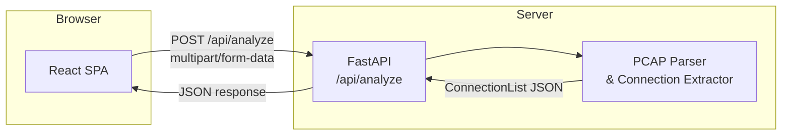

# Design Document: PCAP Analyzer

## Overview

The PCAP Analyzer is a web application that allows users to upload packet capture files (`.pcap` / `.pcapng`) and view a structured table of network connections extracted from the file. Each connection is represented as a single row identified by its 5-tuple (source IP, destination IP, protocol, source port, destination port). TCP connections additionally show a termination reason (FIN, RST, or Timeout).

The application has no authentication and is designed for quick, frictionless use by network analysts.

### Technology Choices

| Layer | Technology | Rationale |
|---|---|---|
| Frontend | React + TypeScript (Vite) | Lightweight SPA, fast dev cycle, strong typing |
| Backend | Python + FastAPI | Excellent PCAP library ecosystem (`scapy` / `dpkt`), async support |
| PCAP parsing | `dpkt` | Pure Python, fast, no native dependency headaches; handles both pcap and pcapng via `dpkt.pcapng` |
| Styling | Plain CSS / Tailwind | Minimal dependency; table-heavy UI needs little framework |

---

## Architecture

The system is a classic two-tier web application: a browser-based SPA communicates with a stateless REST API backend over HTTP.



### Request Flow

1. User selects a file in the browser. The UI validates size (≤ 100 MB) and extension (`.pcap` / `.pcapng`) before sending.
2. The UI sends a `POST /api/analyze` request with the file as `multipart/form-data` and shows a loading indicator.
3. FastAPI receives the upload, streams it into memory, and passes the raw bytes to the Parser.
4. The Parser reads the file with `dpkt`, iterates packets, builds a connection map keyed on the 5-tuple, and determines TCP termination reasons.
5. The API serialises the connection list to JSON and returns it.
6. The UI renders the connection table (one row per connection).

---

## Components and Interfaces

### Frontend Components

```
App
├── UploadForm          – file input, submit button, client-side validation
├── LoadingIndicator    – shown while awaiting API response
├── ErrorBanner         – displays upload/parse errors
└── ConnectionTable     – renders the results table
    └── ConnectionRow   – one row per connection
```

#### `UploadForm`

- Accepts only `.pcap` / `.pcapng` via the `accept` attribute.
- Validates file size client-side; shows `ErrorBanner` if > 100 MB.
- On submit, calls `POST /api/analyze` and manages loading/error state.

#### `ConnectionTable`

Columns (always present):

| Column | Description |
|---|---|
| Source IP | IPv4 or IPv6 address |
| Destination IP | IPv4 or IPv6 address |
| Protocol | IANA name or numeric value |
| Source Port | Integer (0 for ICMP / non-port protocols) |
| Destination Port | Integer (0 for ICMP / non-port protocols) |
| TCP Termination | `FIN`, `RST`, `Timeout`, or empty for non-TCP |

When the result set is empty, the table area is replaced by a "No connections found" message.

### Backend Components

#### `POST /api/analyze` endpoint

```
Request:  multipart/form-data  { file: UploadFile }
Response (success, 200):
  {
    "connections": [ConnectionDTO]
  }
Response (error, 400):
  {
    "error": "<human-readable message>"
  }
```

#### `PcapParser`

Responsible for:
1. Detecting file format (pcap vs pcapng) by magic bytes.
2. Iterating all packets.
3. Extracting the IP layer (IPv4 / IPv6) and transport layer (TCP, UDP, ICMP, other).
4. Building a `ConnectionMap` keyed on the canonical 5-tuple.
5. Tracking TCP flags per flow to determine termination reason.
6. Returning a list of `Connection` objects.

---

## Data Models

### Backend (Python)

```python
from dataclasses import dataclass, field
from enum import Enum
from typing import Optional

class TerminationReason(str, Enum):
    FIN = "FIN"
    RST = "RST"
    TIMEOUT = "Timeout"

@dataclass
class Connection:
    src_ip: str                              # dotted-decimal or IPv6 string
    dst_ip: str
    protocol: str                            # IANA name or numeric string
    src_port: int                            # 0 for protocols without ports
    dst_port: int
    tcp_termination: Optional[TerminationReason] = None  # None for non-TCP
```

### API Response (JSON / TypeScript)

```typescript
interface Connection {
  src_ip: string;
  dst_ip: string;
  protocol: string;
  src_port: number;
  dst_port: number;
  tcp_termination: "FIN" | "RST" | "Timeout" | null;
}

interface AnalyzeResponse {
  connections: Connection[];
}

interface AnalyzeError {
  error: string;
}
```

### 5-Tuple Key

The connection map key is a tuple `(src_ip, dst_ip, protocol_number, src_port, dst_port)`. Packets are **not** bidirectionally merged — a flow from A→B and B→A are treated as separate connections, consistent with how raw captures represent them.

### TCP Termination Logic

```
seen_fin = False
seen_rst = False

for each packet in flow:
    if RST flag set: seen_rst = True
    if FIN flag set: seen_fin = True

termination =
    RST     if seen_rst
    FIN     if seen_fin and not seen_rst
    Timeout otherwise
```

RST takes priority over FIN (Requirement 4.4).

### Protocol Name Resolution

A static lookup table maps IANA protocol numbers to names for the most common protocols (TCP=6, UDP=17, ICMP=1, ICMPv6=58, SCTP=132, etc.). Unknown numbers are rendered as their decimal string.

---


## Correctness Properties

*A property is a characteristic or behavior that should hold true across all valid executions of a system — essentially, a formal statement about what the system should do. Properties serve as the bridge between human-readable specifications and machine-verifiable correctness guarantees.*

### Property 1: Invalid file yields an error

*For any* byte sequence that is not a valid pcap or pcapng file, the parser SHALL return an error result rather than a (possibly empty) connection list.

**Validates: Requirements 1.3**

---

### Property 2: File size gate

*For any* file whose size in bytes exceeds 100 × 1024 × 1024 (100 MB), the client-side validator SHALL reject it and produce an error message; *for any* file whose size is at or below that limit, the validator SHALL not reject it on size grounds.

**Validates: Requirements 1.4**

---

### Property 3: Row count equals distinct 5-tuples

*For any* valid PCAP file, the number of rows returned by the analyzer SHALL equal the number of distinct 5-tuples `(src_ip, dst_ip, protocol, src_port, dst_port)` present across all packets in the file. This simultaneously validates deduplication (no extra rows) and completeness (no missing rows).

**Validates: Requirements 2.1, 2.3, 3.3**

---

### Property 4: Row completeness

*For any* connection in the result set, the rendered table row SHALL contain non-null values for all five base columns (src IP, dst IP, protocol, src port, dst port). Additionally, if the connection's protocol is TCP the `tcp_termination` field SHALL be one of `FIN`, `RST`, or `Timeout`; if the protocol is not TCP the field SHALL be `null` / empty.

**Validates: Requirements 2.2, 4.1, 4.6**

---

### Property 5: Protocol coverage

*For any* valid PCAP file containing at least one packet of IP protocol number P, the result set SHALL contain at least one connection whose protocol field corresponds to P.

**Validates: Requirements 3.1**

---

### Property 6: Protocol name resolution

*For any* IANA-registered protocol number N with an assigned name, the protocol display function SHALL return that IANA name. *For any* protocol number N that has no IANA name, the function SHALL return the decimal string representation of N.

**Validates: Requirements 3.2**

---

### Property 7: TCP termination — FIN

*For any* TCP flow whose packet sequence contains at least one FIN-flagged packet and no RST-flagged packets, the analyzer SHALL classify `tcp_termination` as `FIN`.

**Validates: Requirements 4.2**
*Edge case covered: a flow with both FIN and RST is handled by Property 8 (RST takes priority — Requirement 4.4).*

---

### Property 8: TCP termination — RST

*For any* TCP flow whose packet sequence contains at least one RST-flagged packet (regardless of whether FIN packets are also present), the analyzer SHALL classify `tcp_termination` as `RST`.

**Validates: Requirements 4.3, 4.4**

---

### Property 9: TCP termination — Timeout

*For any* TCP flow whose packet sequence contains neither a FIN-flagged nor a RST-flagged packet, the analyzer SHALL classify `tcp_termination` as `Timeout`.

**Validates: Requirements 4.5**

---

## Error Handling

| Scenario | Detection point | Response |
|---|---|---|
| File extension not `.pcap` / `.pcapng` | UI (before upload) | `ErrorBanner`: "Only .pcap and .pcapng files are supported." |
| File size > 100 MB | UI (before upload) | `ErrorBanner`: "File exceeds the 100 MB size limit." |
| File bytes are not valid pcap/pcapng | Backend parser | HTTP 400 `{"error": "Invalid PCAP file: <detail>"}` |
| File is valid pcap but contains no IP packets | Backend parser | HTTP 200 `{"connections": []}` — UI shows "No connections found." |
| Unexpected server error | Backend (exception handler) | HTTP 500 `{"error": "Internal server error."}` |
| Network / fetch failure | UI (fetch catch) | `ErrorBanner`: "Could not reach the server. Please try again." |

The backend never returns raw stack traces to the client. All exceptions are caught at the API boundary and mapped to structured JSON error responses.

---

## Testing Strategy

### Dual Testing Approach

Both unit tests and property-based tests are required. They are complementary:

- **Unit tests** cover specific examples, integration points, and edge cases.
- **Property-based tests** verify universal invariants across randomly generated inputs.

### Property-Based Testing

**Library**: [`hypothesis`](https://hypothesis.readthedocs.io/) (Python) for backend properties; [`fast-check`](https://fast-check.io/) (TypeScript) for frontend properties.

Each property-based test MUST:
- Run a minimum of **100 iterations**.
- Include a comment tag in the format:
  `# Feature: pcap-analyzer, Property N: <property_text>`

Mapping of design properties to tests:

| Property | Test description | Library |
|---|---|---|
| P1 — Invalid file → error | Generate random non-pcap bytes; assert parser raises/returns error | hypothesis |
| P2 — File size gate | Generate sizes around the 100 MB boundary; assert correct accept/reject | fast-check |
| P3 — Row count = distinct 5-tuples | Build synthetic pcap with random packets; assert `len(result) == len(distinct_5tuples)` | hypothesis |
| P4 — Row completeness | Generate random Connection objects; render rows; assert all fields present and tcp_termination correct | fast-check |
| P5 — Protocol coverage | Build synthetic pcap with random protocol numbers; assert each protocol appears in result | hypothesis |
| P6 — Protocol name resolution | Generate protocol numbers; assert known ones return IANA name, unknown return decimal string | hypothesis |
| P7 — TCP FIN termination | Generate TCP packet sequences with FIN, no RST; assert termination == FIN | hypothesis |
| P8 — TCP RST termination | Generate TCP packet sequences with RST (with and without FIN); assert termination == RST | hypothesis |
| P9 — TCP Timeout termination | Generate TCP packet sequences with neither FIN nor RST; assert termination == Timeout | hypothesis |

### Unit Tests

Focus on:
- Specific known-good pcap fixtures (real-world captures with known connection counts).
- Edge cases: empty pcap, pcap with only non-IP frames (e.g., ARP only), IPv6-only capture.
- API integration: correct HTTP status codes for valid upload, invalid file, oversized file.
- UI component rendering: `ConnectionTable` with zero rows shows "No connections found" message.
- UI component rendering: `UploadForm` `accept` attribute is set correctly.
- No-auth example: API endpoint returns 200 with no `Authorization` header present.

### Test File Structure

```
backend/
  tests/
    test_parser.py          # unit + property tests for PcapParser
    test_api.py             # integration tests for /api/analyze endpoint
    fixtures/               # small real pcap files for unit tests

frontend/
  src/
    __tests__/
      ConnectionTable.test.tsx
      UploadForm.test.tsx
      protocolName.test.ts  # property tests via fast-check
```
